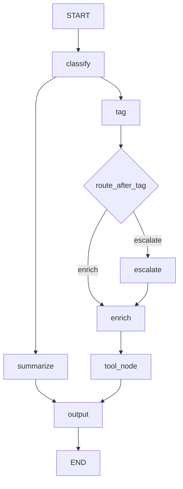

# Tool-Using Agent




## What This Pattern Is
A tool-using agent lets the model choose and use tools as part of its workflow. The model does not only generate text, it can also take actions through tools.

This makes the system more capable, but also more important to design carefully. Tool use should stay explicit and controlled.

## Why It Matters
Tools extend what an agent can do. They let it summarize, calculate, look up information, or interact with other systems instead of only replying from memory.

They also make the agent more practical. When a task needs real actions or external data, tools are what turn a model into a useful system.

## When To Use It
Use it when:
- the task needs actions or calculations
- the model needs external information
- tool use adds real value to the workflow

## When Not To Use It
Do not use it when:
- the model can answer safely without tools
- the task is simple
- tool use would add unnecessary complexity

## Anthropic BEA Connection
This matches the BEA focus on clear control flow, focused responsibilities, and well-designed tool interfaces.

## How This Repo Demonstrates It
This folder shows an agent that classifies content, summarizes it, branches when needed, and uses tools explicitly. The workflow keeps each part visible so the behavior is easy to understand.

## Run It
```bash
make run-agent
```

## Key Takeaway
Tool use is most effective when it is explicit, narrow, and easy to trace.
