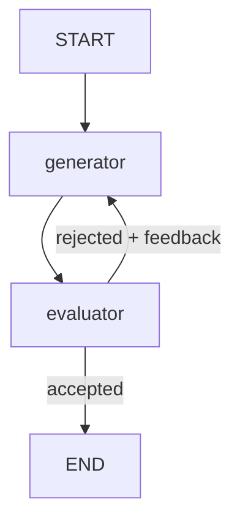

# Evaluator-Optimizer




## What This Pattern Is
Evaluator-optimizer is a feedback loop. One node generates output, another evaluates it, and the result is sent back for improvement if needed.

This pattern is useful when the first attempt is good, but not always good enough. The workflow keeps refining the output until it reaches an acceptable level.

## Why It Matters
This pattern improves quality through iteration. Instead of expecting one generation pass to be perfect, you let the system critique and refine itself.

It is especially useful when quality is subjective, when feedback is clear, and when the model can use that feedback to improve the next attempt.

## When To Use It
Use it when:
- the output can be evaluated clearly
- feedback can improve the next result
- iterative refinement is valuable

## When Not To Use It
Do not use it when:
- the output is already good enough in one pass
- evaluation criteria are unclear
- repeated loops would waste time

## Anthropic BEA Connection
This aligns with the BEA idea that adding loops is worth it only when they demonstrably improve the result.

## How This Repo Demonstrates It
This folder shows a joke generator that keeps improving based on evaluator feedback until the result is accepted. The loop continues only when the evaluator says the output needs work.

## Run It
```bash
make run-evaluator-optimizer
```

## Key Takeaway
Evaluator-optimizer is best when feedback can clearly guide better output.
