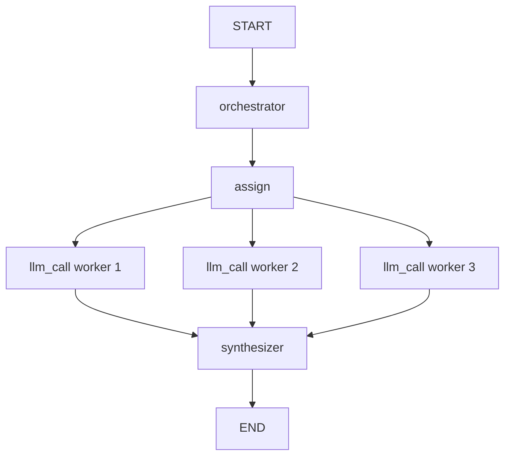

# Orchestrator-Workers




## What This Pattern Is
An orchestrator-workers workflow uses one central node to plan the work and then delegates pieces of that work to worker nodes. The workers handle the smaller tasks, and the orchestrator later combines the results.

This pattern is helpful when the number or type of subtasks is not known in advance. The orchestrator decides what needs to be done based on the input.

## Why It Matters
This pattern is powerful for complex tasks because it supports dynamic decomposition. Instead of forcing one node to do everything, the workflow can break the job into smaller responsibilities.

It also mirrors how people often solve large problems: plan first, then assign parts, then synthesize the final answer.

## When To Use It
Use it when:
- the task is complex
- the subtasks are not fixed ahead of time
- you need planning, delegation, and synthesis

## When Not To Use It
Do not use it when:
- the task is already small
- the number of steps is fixed and simple
- a single prompt or chain is enough

## Anthropic BEA Connection
This matches the BEA idea of building agents from small composable parts and using the right structure only when the task requires it.

## How This Repo Demonstrates It
This folder shows a report workflow where sections are planned first, assigned to workers, and then merged into one final report. The orchestrator handles planning while the workers handle the section writing.

## Run It
```bash
make run-orchestrator-workers
```

## Key Takeaway
Orchestrator-workers is useful when a task needs a central planner and flexible delegation.
