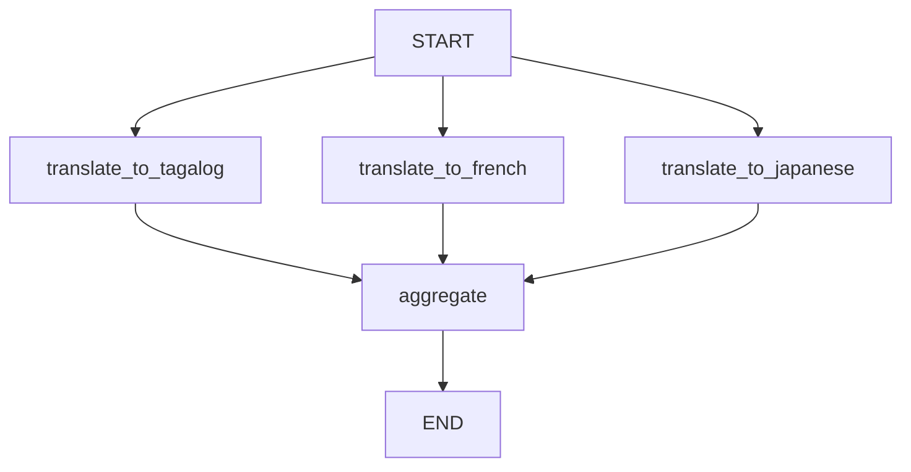

# Parallelization




## What This Pattern Is
Parallelization runs independent subtasks at the same time and combines the results later. Each branch works on the same input but produces a different output.

This is useful when the work does not need strict sequencing. Instead of waiting for one step to finish before starting another, the workflow can do multiple things at once.

## Why It Matters
Parallelization can improve speed and efficiency. It also helps when you want multiple views of the same input, such as different translations or different evaluations.

Because each branch is isolated, it can also make the workflow simpler to design and test.

## When To Use It
Use it when:
- the subtasks are independent
- the output can be merged later
- you want speed or multiple perspectives

## When Not To Use It
Do not use it when:
- one task depends on another task's output
- the subtasks are not truly independent
- merging the results would be unclear

## Anthropic BEA Connection
This follows the BEA principle of keeping each part small and focused, then combining the results in a clean final step.

## How This Repo Demonstrates It
This folder shows one input being translated into multiple languages in parallel, then gathered into one result list. Each branch does one job and the aggregator combines them.

## Run It
```bash
make run-parallelization
```

## Key Takeaway
Parallelization works best when separate tasks can run independently and then be merged.
