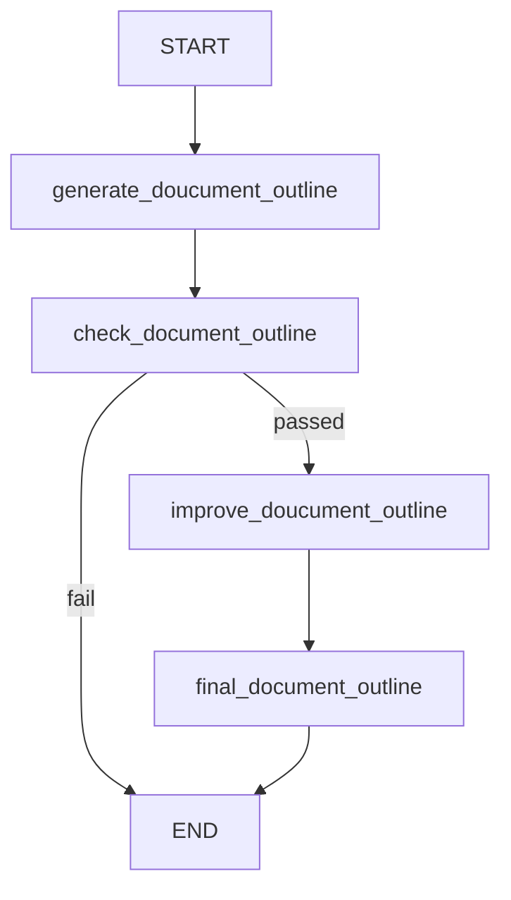

# Prompt Chaining




## What This Pattern Is
Prompt chaining breaks one task into a sequence of smaller steps. Each step uses the output of the previous step, so the workflow becomes easier to manage and improve.

This pattern is useful when one prompt feels too broad. Instead of asking the model to do everything at once, you guide it through a clear order of operations.

## Why It Matters
Prompt chaining helps reduce complexity. Each step can focus on one smaller goal, which often improves reliability and makes the output easier to debug.

It also gives you more control. If one step is weak, you can adjust only that part instead of rewriting the entire workflow.

## When To Use It
Use it when:
- the task has a natural sequence
- each step can improve the next step
- you want more control over intermediate output

## When Not To Use It
Do not use it when:
- the task is already simple
- the steps do not clearly depend on each other
- one prompt can solve the job well enough

## Anthropic BEA Connection
This matches Anthropic's guidance to start with the simplest useful structure and only add more steps when they improve the result.

## How This Repo Demonstrates It
This folder shows a workflow where an outline is generated, checked, improved, and then finalized. Each stage builds on the previous one.

## Run It
```bash
make run-prompt-chaining
```

## Key Takeaway
Prompt chaining is best when the task becomes better by being solved in small ordered steps.
