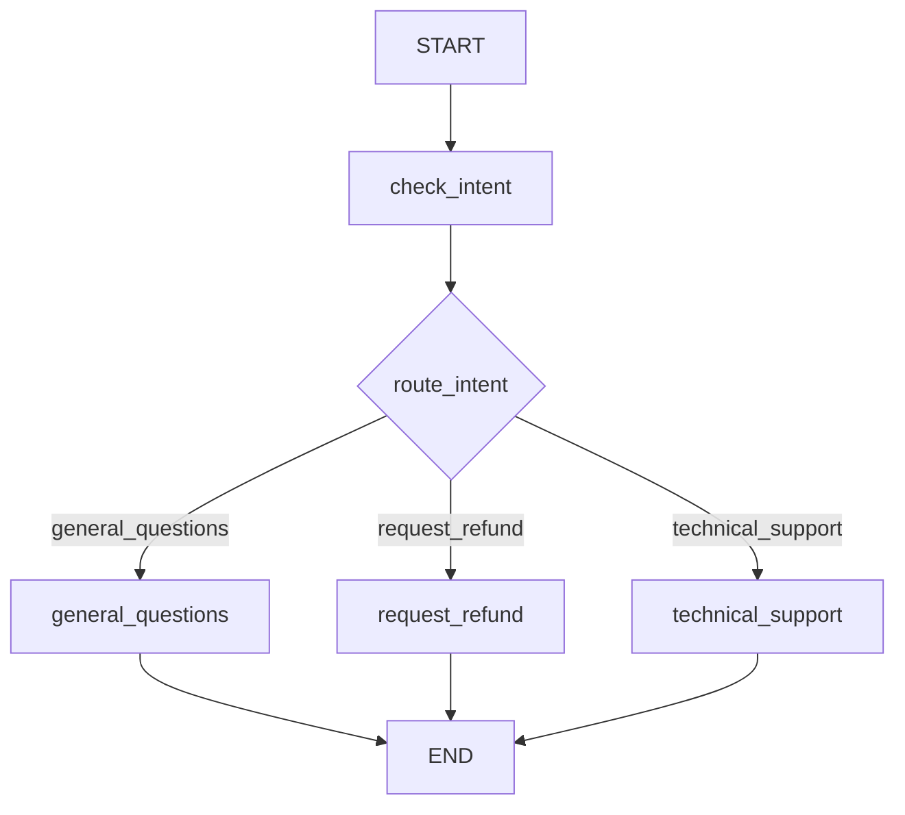

# Routing




## What This Pattern Is
Routing classifies an input first and then sends it to the right specialized path. Instead of one prompt trying to handle everything, the workflow chooses a focused branch.

This is a good fit when different kinds of requests need different treatment. It keeps the system organized and easier to reason about.

## Why It Matters
Routing helps separate concerns. General questions, refunds, and technical support do not need the same prompt or the same logic.

It also makes the system easier to maintain. Each path can be tuned independently without affecting the others.

## When To Use It
Use it when:
- inputs fall into clear categories
- each category needs a different response style
- you want specialist handling for each path

## When Not To Use It
Do not use it when:
- all inputs should follow the same flow
- classification would be unreliable
- the extra branching adds unnecessary complexity

## Anthropic BEA Connection
This reflects the BEA idea of building focused, composable workflows instead of one large prompt that tries to do everything.

## How This Repo Demonstrates It
This folder shows customer support routing for general questions, refund requests, and technical support. The first step decides the intent, then the workflow sends the query to the matching path.

## Run It
```bash
make run-routing
```

## Key Takeaway
Routing makes one system behave like several smaller specialist systems.
